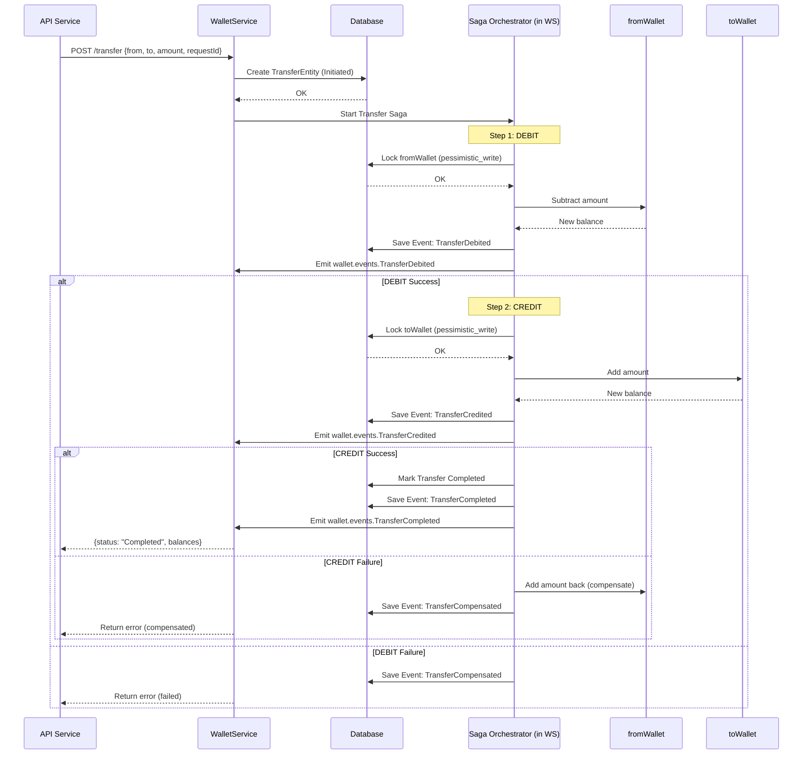

# Event-Driven Wallet Microservice – Design Document

## 1. Overview

This service is an **event-driven wallet system** designed to handle financial transactions with strong consistency guarantees and real-time analytics. The system provides:

- **Per-wallet balance management** with ACID guarantees
- **Deposits, withdrawals, and transfers** with idempotency and strong consistency
- **Immutable domain events** for each state change
- **Background event processing** for analytics, fraud detection, and notifications
- **Fault tolerance** via Dead Letter Queue (DLQ) for failed message processing

### Architecture

The system is implemented as a monorepo with the following structure:

| Component | Purpose |
|-----------|---------|
| `services/api` | Synchronous HTTP API & write model |
| `services/worker` | Asynchronous event processor (analytics & fraud detection) |
| `libs/common` | Shared enums, event contracts, and types |
| `libs/db-orm` | TypeORM entities & shared persistence layer |

---

## 2. Requirements Mapping

### 2.1 HTTP API Endpoints

| Method | Endpoint | Description |
|--------|----------|-------------|
| `POST` | `/wallet/:id/deposit` | Deposit funds into a wallet |
| `POST` | `/wallet/:id/withdraw` | Withdraw funds from a wallet |
| `POST` | `/wallet/:id/transfer` | Transfer funds between wallets |
| `GET` | `/wallet/:id` | Get wallet balance and details |
| `GET` | `/wallet/:id/history` | Get wallet transaction history |

### 2.2 Event-Driven Behavior

- Every successful write operation stores an immutable `EventEntity`
- API publishes `WalletEventMessage` to RabbitMQ `wallet.events` exchange
- Worker consumes events from `wallet.events.worker` queue and updates analytics/fraud flags

### 2.3 Idempotency Guarantees

| Layer | Mechanism | Key |
|-------|-----------|-----|
| **API Operations** | `OperationEntity` | `(requestId, walletId)` |
| **Transfers** | `TransferEntity` | `requestId` + `status` |
| **Worker Processing** | `ProcessedEventEntity` | `eventId` (PK) |

### 2.4 Transfer Saga Pattern

Transfers are implemented as a **Saga** with compensation:

```
Initiated → Debited → Completed
                ↓
           Compensated → Failed
```

- **Debit** and **credit** are separate transactional steps
- On credit failure, a **compensating transaction** restores sender's funds
- Each step has its own operation record and event

### 2.5 Background Worker Features

The worker implements real business logic beyond simple logging:

**Analytics Projection (`wallet_stats`)**
- Total deposited/withdrawn/transferred in/out
- Last activity timestamp
- Suspicious activity flags and reasons

**Fraud Detection Rules**
- Flags wallets with **≥3 withdrawals in 60 seconds**
- Flags **single withdrawal ≥ configurable threshold** (e.g., 10,000)

**Notification System**
- Logs notification stubs for suspicious activity
- Ready for integration with email services (SES/SendGrid)

### 2.6 Fault Tolerance (DLQ)

| Component | Purpose |
|-----------|---------|
| `wallet.events.worker` | Main processing queue |
| `wallet.events.dlx` | Dead Letter Exchange |
| `wallet.events.worker.dlq` | Dead Letter Queue for failed messages |

Poison messages are `nack`'ed with `requeue=false` and routed to DLQ for manual inspection.

---

## 3. Architecture

### 3.1 System Components

```
┌─────────────┐      ┌──────────────┐      ┌─────────────┐
│   Client    │─────▶│  API Service │─────▶│  Postgres   │
└─────────────┘      └──────┬───────┘      └─────────────┘
                            │
                            ▼
                     ┌──────────────┐
                     │   RabbitMQ   │
                     └──────┬───────┘
                            │
                            ▼
                     ┌──────────────┐      ┌─────────────┐
                     │    Worker    │─────▶│  Postgres   │
                     └──────────────┘      └─────────────┘
```

**API Service (NestJS)**
- Handles HTTP requests
- Manages wallet state with TypeORM + Postgres
- Publishes events to RabbitMQ (`wallet.events` exchange)

**Worker Service (NestJS)**
- Consumes from `wallet.events.worker` queue
- Updates `wallet_stats` projection via TypeORM
- Applies fraud detection rules
- Routes failed messages to DLQ

**Postgres**
- Single source of truth for wallet balances and history
- Stores: wallets, events, operations, transfers, stats, processed events

**RabbitMQ**
- `wallet.events` (fanout exchange) – publishes wallet domain events
- `wallet.events.worker` (queue) – bound to exchange
- `wallet.events.dlx` (DLX) + `wallet.events.worker.dlq` (DLQ)

---

## 4. Data Model

### 4.1 Core Entities

#### WalletEntity
```typescript
{
  id: string (PK)
  balance: numeric(precision: 4)
  
  // Relationships
  events: EventEntity[]
  operations: OperationEntity[]
}
```

#### EventEntity (Immutable Event Log)
```typescript
{
  id: UUID (PK)
  type: EventType // WalletCreated, FundsDeposited, FundsWithdrawn, etc.
  walletId: string | null
  transferId: UUID | null
  payload: JSONB // Full event data
  createdAt: timestamp
}
```

**Event Types:**
- `WalletCreated`
- `FundsDeposited`
- `FundsWithdrawn`
- `TransferInitiated`
- `TransferDebited`
- `TransferCredited`
- `TransferCompleted`
- `TransferCompensated`

#### OperationEntity (Idempotency & Audit)
```typescript
{
  id: UUID
  requestId: string // Client-supplied idempotency key
  walletId: string
  type: OperationType // Deposit, Withdraw, TransferDebit, etc.
  success: boolean
  errorMessage: string | null
  responseSnapshot: JSONB // Response returned to client
  createdAt: timestamp
  
  // Unique constraint: (requestId, walletId)
}
```

#### TransferEntity (Saga State)
```typescript
{
  id: UUID
  fromWalletId: string
  toWalletId: string
  amount: numeric string
  status: TransferStatus // Initiated, Debited, Completed, Failed
  requestId: string // Idempotency key
  lastError: string | null
  createdAt: timestamp
  updatedAt: timestamp
}
```

### 4.2 Worker Projections

#### WalletStatsEntity (Analytics)
```typescript
{
  walletId: string (PK)
  totalDeposited: numeric string
  totalWithdrawn: numeric string
  totalTransferredOut: numeric string
  totalTransferredIn: numeric string
  lastActivityAt: timestamp
  suspicious: boolean
  suspiciousReason: string | null
  createdAt: timestamp
  updatedAt: timestamp
}
```

#### ProcessedEventEntity (Worker Idempotency)
```typescript
{
  eventId: string (PK)
  status: 'success' | 'failed'
  errorMessage: string | null
  processedAt: timestamp
}
```

---

## 5. Write Path

### 5.1 Deposit Flow

```
1. Idempotency Check
   ↓
2. Transaction (with pessimistic lock)
   - Create wallet if needed
   - Update balance
   - Insert EventEntity
   - Insert OperationEntity
   ↓
3. Publish Event to RabbitMQ
```

**Implementation Details:**

1. **Idempotency Check**
   - Query `OperationEntity` by `(requestId, walletId)`
   - If found with `success=true` → return cached `responseSnapshot`

2. **Transaction**
   - Acquire `pessimistic_write` lock on `WalletEntity`
   - Create wallet if doesn't exist
   - Update: `balance += amount`
   - Insert event: `WalletCreated` (new) or `FundsDeposited`
   - Insert `OperationEntity` with `type=Deposit`

3. **Event Publishing**
   - After commit, publish `WalletEventMessage` to RabbitMQ

### 5.2 Withdraw Flow

```
1. Idempotency Check
   ↓
2. Transaction (with pessimistic lock)
   - Validate wallet exists
   - Validate sufficient balance
   - Update balance
   - Insert EventEntity
   - Insert OperationEntity
   ↓
3. Publish Event to RabbitMQ
```

**Failure Handling:**
- Wallet not found → `NotFoundException` + failed operation record
- Insufficient balance → `BadRequestException` + failed operation record
- Failed operations are idempotent (re-throw same error on retry)

### 5.3 Transfer Saga Flow

```
1. Create/Find TransferEntity
   ↓
2. Debit Step
   - Lock sender wallet
   - Validate & debit
   - Insert TransferDebited event
   - Update status to Debited
   ↓
3. Credit Step
   - Lock receiver wallet
   - Create wallet if needed
   - Credit amount
   - Insert TransferCredited event
   - Update status to Completed
   ↓
4. Compensation (on failure)
   - Lock sender wallet
   - Restore amount
   - Insert TransferCompensated event
   - Update status to Failed
```

**Idempotency:**
- If `TransferEntity` with `requestId` exists and `status=Completed` → return final state
- Each step uses separate operation keys: `{requestId}-debit`, `{requestId}-credit`, `{requestId}-compensate`

#### Transfer Saga Sequence Diagram




---

## 6. Read Path & Optimizations

### 6.1 Balance Query

**Endpoint:** `GET /wallet/:id`

```sql
SELECT id, balance FROM wallet WHERE id = :id
```

**Response:**
- If found: `{ walletId, balance, exists: true }`
- If not found: `{ walletId, balance: '0.0000', exists: false }`

**Optimization:** Primary key index (default)

### 6.2 History Query

**Endpoint:** `GET /wallet/:id/history?limit=50&before=<timestamp>`

```sql
SELECT id, walletId, transferId, type, payload, createdAt
FROM event
WHERE walletId = :id
  AND createdAt < :before
ORDER BY createdAt DESC
LIMIT :limit
```

**Recommended Index:** `(walletId, createdAt DESC)`

### 6.3 Read/Write Separation

**Current Approach:**
- Shared database for reads and writes
- Logical separation: transactional writes vs. lean queries

**Trade-offs:**
- Simpler deployment and operations
- Easier to maintain consistency
- Read throughput limited by write database

**Future Evolution:**
- Can migrate to CQRS with separate read store
- `wallet_stats` already demonstrates projection pattern

---

## 7. Background Worker Logic

### 7.1 Message Processing Workflow

```
1. Connect to RabbitMQ
   ↓
2. Declare queues & DLX
   ↓
3. Consume WalletEventMessage
   ↓
4. Process Event
   - Check ProcessedEventEntity (idempotency)
   - Update WalletStatsEntity
   - Apply fraud rules
   - Insert ProcessedEventEntity
   ↓
5. ACK (success) or NACK → DLQ (failure)
```

### 7.2 Analytics Updates

| Event Type | Stats Update |
|------------|--------------|
| `FundsDeposited` | `totalDeposited += amount` |
| `FundsWithdrawn` | `totalWithdrawn += amount` |
| `TransferCompleted` | Sender: `totalTransferredOut += amount`<br>Receiver: `totalTransferredIn += amount` |
| All events | `lastActivityAt = occurredAt` |

### 7.3 Fraud Detection Rules

**Rule 1: Rapid Withdrawals**
```typescript
if (withdrawalsInLast60Seconds >= 3) {
  wallet_stats.suspicious = true
  wallet_stats.suspiciousReason = "More than 3 withdrawals within 60 seconds"
}
```

**Rule 2: Large Withdrawal**
```typescript
if (amount >= THRESHOLD) {
  wallet_stats.suspicious = true
  wallet_stats.suspiciousReason = "Single large withdrawal >= threshold"
}
```

**Notification:**
- Logs: `"Suspicious activity on wallet X: ... – would send email here"`
- Ready for SES/SendGrid integration

### 7.4 Idempotency & DLQ

**Idempotency:**
- `ProcessedEventEntity` prevents duplicate processing
- Handles RabbitMQ at-least-once delivery semantics

**DLQ Behavior:**
```typescript
try {
  await handleEvent(event)
  channel.ack(msg)
} catch (error) {
  await markEventFailed(event.id, error)
  channel.nack(msg, false, false) // requeue=false → DLQ
}
```

---

## 8. Idempotency & Concurrency

### 8.1 API Idempotency Strategy

**Per-Operation Idempotency:**
- Key: `(requestId, walletId)`
- Success: Return cached `responseSnapshot`
- Failure: Re-throw original error

**Transfer Idempotency:**
- Key: `requestId` on `TransferEntity`
- If `status=Completed` → return final state without re-execution

### 8.2 Concurrency Control

**Pessimistic Locking:**
```typescript
await manager.findOne(WalletEntity, {
  where: { id: walletId },
  lock: { mode: 'pessimistic_write' }
})
```

**Benefits:**
- Serializes writes per wallet
- Prevents race conditions
- Enables horizontal scaling of API instances

**Scalability:**
- Database coordinates consistency across API instances
- Connection pooling handles concurrent requests
- Per-wallet locking allows parallel operations on different wallets

### 8.3 Stress Testing

**Tool:** `tools/monkey-test.js`

**Purpose:**
- Validates system under high concurrency (1,000+ operations)
- Tests transaction safety, locking, and idempotency
- Verifies worker throughput

**Validation Points:**
- No negative balances
- No duplicate processing
- Correct final balances after concurrent operations

---

## 9. Consistency Model & Trade-offs

### 9.1 Consistency Guarantees

**Strong Consistency (Wallet Balances):**
- ✅ ACID transactions with row-level locks
- ✅ No negative balances
- ✅ Idempotent operations
- ✅ Immediate consistency for reads

**Eventual Consistency (Analytics):**
- ⏱️ `wallet_stats` updated asynchronously
- ⏱️ Slight delay between operation and fraud flag
- ⏱️ Acceptable for analytics use case

### 9.2 Architecture Trade-offs

| Aspect | Current Approach | Alternative | Trade-off |
|--------|------------------|-------------|-----------|
| **Database** | Single Postgres | Separate read/write DBs | Simplicity vs. scalability |
| **Schema** | Shared for read+write | CQRS with projections | Easier ops vs. read performance |
| **Deployment** | Monorepo | Separate services | Simpler vs. independent scaling |

**Rationale:**
- Current approach prioritizes **simplicity** and **operational ease**
- Suitable for assignment scope and moderate scale
- Clear migration path to CQRS if needed

---

## 10. Testing Strategy

### 10.1 API Service Tests

**Unit Tests for `WalletService`:**

| Test Case | Verification |
|-----------|--------------|
| Deposit (new wallet) | Creates wallet, emits `WalletCreated`, persists operation |
| Deposit (existing) | Updates balance, emits `FundsDeposited`, returns snapshot |
| Deposit (duplicate) | Returns cached response (idempotent) |
| Withdraw (success) | Deducts balance, emits `FundsWithdrawn`, persists operation |
| Withdraw (insufficient) | Throws `BadRequestException`, records failed operation |
| Transfer (success) | Completes saga, emits all events, updates both wallets |
| Transfer (duplicate) | Returns final state without re-execution |
| Transfer (same wallet) | Rejects with validation error |

**Mocking:**
- Repositories, DataSource, RabbitMqService
- Fast, isolated tests

### 10.2 Worker Tests

**Unit Tests for `WalletEventsHandlerService`:**

| Test Case | Verification |
|-----------|--------------|
| Analytics update | Correctly updates `totalDeposited`, `totalWithdrawn`, etc. |
| Fraud detection | Flags wallet after 3 withdrawals in 60s |
| Large withdrawal | Flags wallet for single large withdrawal |
| Idempotency | Skips processing for already-processed events |
| Stats creation | Creates `WalletStatsEntity` if missing |

**Coverage:**
- Real business logic validation
- Idempotent behavior verification

---

## 11. Future Improvements

### 11.1 Scalability Enhancements

- **Authentication & Authorization:** Secure wallet operations
- **Email Integration:** Real notifications via SES/SendGrid
- **Rate Limiting:** Per-wallet and per-IP protection
- **Audit Trail:** Enhanced compliance and debugging capabilities

---

## Appendix: Event Flow Diagram

```
┌─────────┐
│ Client  │
└────┬────┘
     │ POST /wallet/:id/deposit
     ▼
┌─────────────────────────────────────────┐
│         API Service                     │
│  1. Idempotency Check                   │
│  2. Transaction (pessimistic lock)      │
│     - Update balance                    │
│     - Insert EventEntity                │
│     - Insert OperationEntity            │
│  3. Commit                              │
└────┬────────────────────────────────────┘
     │
     │ Publish WalletEventMessage
     ▼
┌─────────────────────────────────────────┐
│         RabbitMQ                        │
│  Exchange: wallet.events (fanout)       │
└────┬────────────────────────────────────┘
     │
     │ Route to queue
     ▼
┌─────────────────────────────────────────┐
│  Queue: wallet.events.worker            │
└────┬────────────────────────────────────┘
     │
     │ Consume
     ▼
┌─────────────────────────────────────────┐
│         Worker Service                  │
│  1. Check ProcessedEventEntity          │
│  2. Update WalletStatsEntity            │
│  3. Apply Fraud Rules                   │
│  4. Insert ProcessedEventEntity         │
│  5. ACK message                         │
└─────────────────────────────────────────┘
```

---
## 12. Technology Trade-Off Analysis

This section documents why specific technologies and patterns were chosen, and what alternatives were considered.

### 12.1 NestJS vs Express
Criteria	NestJS	Express
Architecture	Opinionated, modular, scalable	Unopinionated, minimal
DX / Productivity	Decorators, DI, modules, pipes, filters	You must build architecture yourself
Testing	Built-in testing utilities	Requires custom setup
Microservices	Native support (RabbitMQ, gRPC, Kafka)	Needs external libs
Learning curve	Higher	Very low
Performance	Slight overhead	Slightly faster raw HTTP
Why NestJS was chosen

- Strong structure for complex systems (modules, DI, providers)
- Consistent conventions → easier onboarding
- First-class CQRS, events, interceptors, guards
- Built-in microservice transports, ideal for RabbitMQ
- Better maintainability for multi-service systems
- Strong TypeScript integration (Express is JS-first)

Trade-offs
- Slightly slower than raw Express (but irrelevant compared to DB/RabbitMQ latency)
- More boilerplate
- Requires deeper knowledge of Nest lifecycle

Conclusion: For a distributed, event-driven wallet system, NestJS provides the right abstractions and maintainability.

### 12.2 TypeORM vs Prisma
Criteria	TypeORM	Prisma
Migrations	Built-in, automatic, CLI	Very strong migrations system
Decorators	Entity decorators (clean in Nest)	Schema-first (external file)
Lazy relations	Supported	Not supported
Query flexibility	Excellent (custom SQL, query builder)	More limited for very complex joins
Performance	Slight overhead	Faster queries at scale
Multi-connection	Good	Good but less flexible
Ecosystem	Deep integration with NestJS	Independent
Why TypeORM was chosen

- Perfect integration with NestJS (@nestjs/typeorm)
- Entity decorators match domain modeling cleanly
- Ability to define rich relations (events, operations, transfers)
- Full support for transactions with isolation levels
- Works extremely well with CQRS, sagas, event sourcing

Trade-offs

- Prisma has a better developer experience (DX)
- Prisma is faster for large scale joins
- TypeORM migrations can be finicky

Conclusion: Because the wallet system uses heavy relations, transactions, pessimistic locks, and sagas, TypeORM gives more control over database behavior.

### 12.3 RabbitMQ vs Other Brokers (Kafka, Redis Streams, SQS)
Broker	Pros	Cons
RabbitMQ	Easy routing (fanout, topic), reliable, ACK/NACK, DLQ, simple ops	Not built for huge throughput like Kafka
Kafka	Extreme scalability, partitioning, replay, streams	Heavy ops, overkill for this assignment
Redis Streams	Simple, fast	Weaker persistence model
AWS SQS	Fully managed, DLQ built-in	Cloud vendor lock-in
Why RabbitMQ was chosen

- Ideal for event-driven workflows between API and worker
- Built-in dead letter queues simplify failure handling
- Best choice for saga-style compensation logic
- Lighter footprint than Kafka

Trade-offs

- Not horizontally scalable like Kafka
- Requires a running broker (not serverless)

Conclusion: RabbitMQ offers the perfect balance between features and complexity for this project.

### 12.4 PostgreSQL vs MongoDB or MySQL
Why PostgreSQL?

- Strong ACID compliance (critical for wallet balances)
- Best support for pessimistic locks (SELECT … FOR UPDATE)
- Reliable transactions for tests, events, operations
- JSONB support for event payload

Trade-offs

- Slightly more complex for horizontal sharding
- MongoDB is easier for event logs, but not for balance correctness
- Conclusion: A wallet requires strict consistency → PostgreSQL is the correct choice.

### 12.5 Saga vs Orchestration

Why Saga Choreography was chosen

- Simpler for this small system
- Natural fit for RabbitMQ
- Each step is independent (debit, credit, compensate)

### 12.6 CQRS vs Single-layer CRUD
Why CQRS was chosen

- Balance reads and writes independently
- Writes require strong consistency (transactions, locks)
- Reads want speed (simple SELECTs, no complex joins)
- Cleaner separation of responsibilities in the code

Trade-offs

- More files and complexity
- Events must be kept consistent

Conclusion: For a wallet, CQRS yields correctness + performance.
